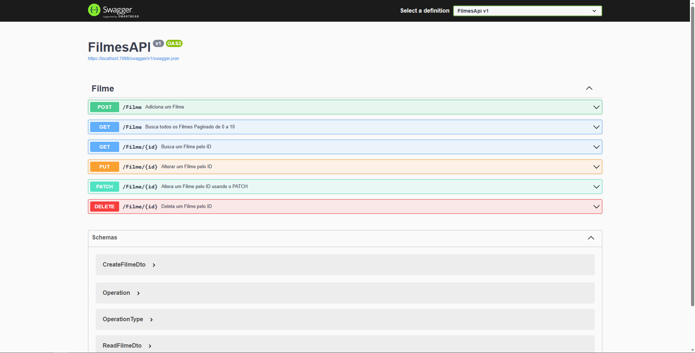

<section align="center">

# Api .NET Core 

Este é um projeto desenvolvido em .NET Core que demonstra a implementação de uma API com operações CRUD (Create, Read, Update, Delete) utilizando Entity Framework, PostgreSQL e Docker. A API oferece endpoints para gerenciar dados por meio de requisições HTTP.

 

## Pré-requisitos

 [.NET Core SDK](https://dotnet.microsoft.com/download)
  
 [Docker](https://www.docker.com/get-started)

 

## Instalação e Execução

1. Clone este repositório para a sua máquina local.
2. Navegue até o diretório do projeto: `cd FilmesApiCore`.
3. Verifique o arquivo docker-compose.yml para saber como configurar o Docker.

 

## 🧑‍💻Tecnologias Utilizadas:
``.NET CORE``
``ENTITY FRAMEWORK``
``AUTOMAPPER``
``NPGSQL``
``POSTGRESQL``
``DOCKER``

 

## 📩 Contato

 mateus_stangherlins@hotmail.com
  
 +55 (46) 9 9123-5798
  
 Linkedin: https://www.linkedin.com/in/mateus-stangherlin-47a1b1230/
